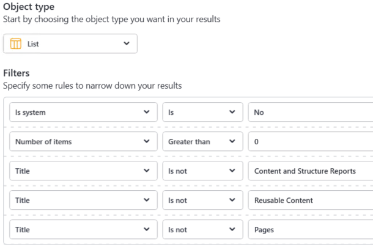

# Sharegate Batch migration Script
Batch migrations from On-Premises SharePoint data to SharePoint Online, can be made more efficient with [Sharegate PowerShell](https://support-desktop.sharegate.com/hc/en-us/categories/204661007-PowerShell) and [SharePoint Online PnP PowerShell](https://docs.microsoft.com/en-us/powershell/sharepoint/sharepoint-pnp/sharepoint-pnp-cmdlets?view=sharepoint-ps) Cmdlets. 

In most case, you would want to migrate only custom lists and libraries that are actively used and preserve items permissions, by merging the SharePoint defaults *Owners*, *Members* and *Visitors* groups. 

This script migrate an array of lists and libraries that could be generated with the *Sharegate Reporting* by filtering only certain lists and libraries conditions:



Prior to run the script, you will need to install SharePoint Online PnP PowerShell module:
```
Install-Module SharePointPnPPowerShellOnline
```
then generate the password secure strings for your environment:

```
($Credential=Get-Credential).Password | ConvertFrom-SecureString
```
an finally populate array of List and Libraries:
```
$ListsToTransform = @(
"Documents",
"Quick links",
"Team Documents",
"Public Pictures"
)
```
